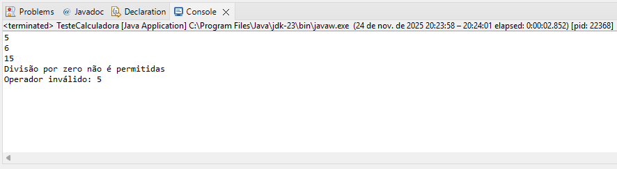

# 📌 Atividade Individual - Tema: Caixa Branca (Parte 2)

Esta classe fornece operações matemáticas básicas como soma, subtração, multiplicação e divisão, além de um método principal que seleciona a operação desejada com base em um operador informado pelo usuário.

Esse projeto é utilizado para demonstrar:
 <ul>
    <li>Técnicas de revisão estática (caixa branca)</li>
    <li>Técnicas de revisão (caixa branca)</li>
    <li>Aplicação de refatoração em código Java</li>
<li>Documentação com Javadoc</li>
</ul>

Após a refatoração, os métodos desta classe são métodos puros, sem efeitos colaterais, permitindo maior legibilidade e facilitando testes unitários.

João Henrique Santos da Silva - 247529 - 24/11/2025

